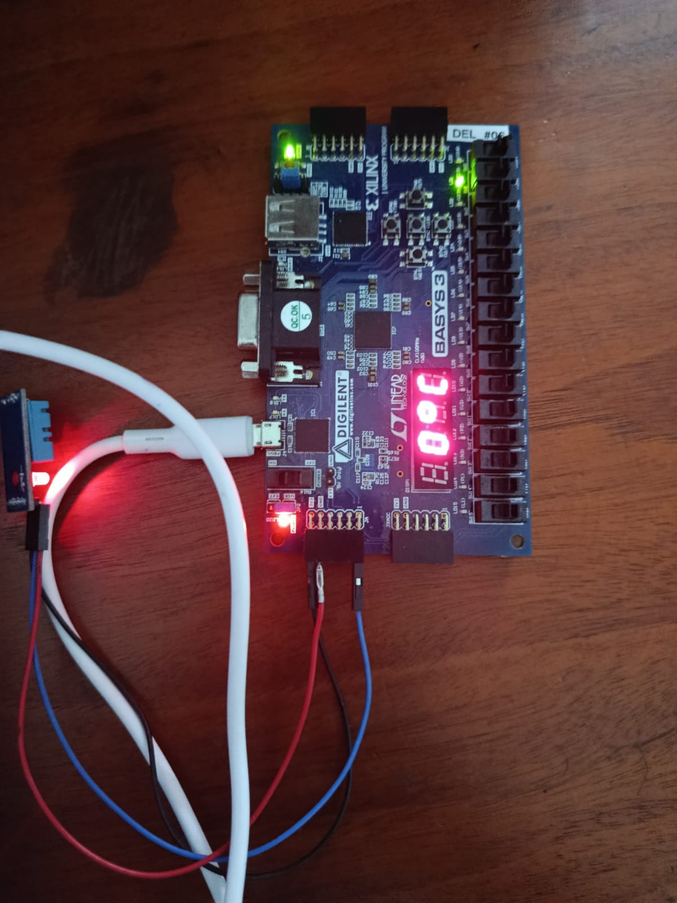

# 🌡️ Smart Temperature Monitoring System

<p align="center">
  <h1 align="center">Smart Temperature Monitoring System</h1>
  <p align="center">
    FPGA-Based Temperature and Humidity Monitoring System
  </p>
</p>

---

## 📌 Project Overview

The **Smart Temperature Monitoring System** is an FPGA-based digital monitoring system developed using **Verilog HDL** and **Xilinx Vivado**. The system uses a **DHT11 temperature and humidity sensor** to collect environmental data, processes the temperature information, displays the temperature on a **4-digit 7-segment display**, and provides an audible warning through a **buzzer** when the temperature exceeds the specified condition.

The system also supports temperature conversion between **Celsius, Fahrenheit, and Kelvin**, with automatic cycling between the available units.

---

## 📸 Project Snapshot

<p align="center">
  
</p>

---

## ✨ Key Features

- 🌡️ Real-time temperature measurement using DHT11
- 💧 Humidity measurement
- 🔢 4-digit 7-segment display
- 🌡️ Celsius, Fahrenheit, and Kelvin conversion
- 🔄 Automatic temperature-unit cycling
- 🔔 Buzzer-based temperature alert
- 🧠 FSM-based DHT11 communication
- ✅ Sensor checksum verification
- ❌ Error detection
- ⏱️ Clock-synchronized digital control
- ⚙️ FPGA-based hardware implementation

---

## 🛠️ Technologies Used

| Category | Technology |
|----------|------------|
| Hardware Platform | FPGA |
| Hardware Description Language | Verilog HDL |
| Development Environment | Xilinx Vivado |
| Temperature & Humidity Sensor | DHT11 |
| Display | 4-Digit 7-Segment Display |
| Alert Device | Buzzer |

---

## 🏗️ System Architecture

```text
                       ┌──────────────────────┐
                       │      DHT11 Sensor    │
                       │ Temperature/Humidity │
                       └──────────┬───────────┘
                                  │
                                  ▼
                       ┌──────────────────────┐
                       │  DHT11 Controller    │
                       │      FSM + Timing    │
                       └──────────┬───────────┘
                                  │
                         Temperature Data
                                  │
                                  ▼
                       ┌──────────────────────┐
                       │   Temperature ALU    │
                       │  Unit Conversion     │
                       └──────────┬───────────┘
                                  │
                    ┌─────────────┼─────────────┐
                    │             │             │
                    ▼             ▼             ▼
                Celsius      Fahrenheit       Kelvin
                    │             │             │
                    └─────────────┼─────────────┘
                                  │
                                  ▼
                       ┌──────────────────────┐
                       │  Unit Cycle Timer    │
                       └──────────┬───────────┘
                                  │
                                  ▼
                       ┌──────────────────────┐
                       │  7-Segment Driver    │
                       └──────────┬───────────┘
                                  │
                                  ▼
                       ┌──────────────────────┐
                       │ 4-Digit 7-Segment    │
                       │      Display         │
                       └──────────────────────┘


                     Temperature Above Condition
                                  │
                                  ▼
                     ┌───────────────────┐
                     │ Buzzer Controller │
                     │    FSM Control    │
                     └─────────┬─────────┘
                               │
                               ▼
                           🔔 Buzzer
```

---

## 🔄 System Working Principle

The overall operation of the system is divided into several stages.

### 1. 🌡️ Temperature and Humidity Sensing

The DHT11 sensor provides temperature and humidity data through a single bidirectional data line.

The FPGA initiates communication with the sensor and receives the 40-bit data frame.

```text
┌──────────────┬──────────────┬──────────────┬──────────────┬──────────────┐
│ Humidity     │ Humidity     │ Temperature  │ Temperature  │ Checksum     │
│ Integer      │ Decimal      │ Integer      │ Decimal      │              │
└──────────────┴──────────────┴──────────────┴──────────────┴──────────────┘
```

The received data is processed by the `dht11_controller` module.

### 2. 🌡️ Temperature Unit Conversion

The temperature data received from the DHT11 sensor is processed by the temperature conversion logic.

The system supports three temperature units:

- **Celsius (°C)**
- **Fahrenheit (°F)**
- **Kelvin (K)**

The conversion is performed using:

```text
Fahrenheit = (Celsius × 9/5) + 32
Kelvin     = Celsius + 273.15
```

The system automatically cycles between the available temperature units using the unit cycle timer.

### 3. 🔢 Temperature Display

The processed temperature value is sent to the **4-digit 7-segment display driver**.

The display driver converts the temperature value into appropriate 7-segment patterns and uses multiplexing to control the four digits.

The currently selected temperature unit is also displayed.

### 4. 🔔 Temperature Alert

The system continuously monitors the measured temperature.

When the temperature exceeds the specified condition, the buzzer controller activates the buzzer and provides an audible warning.

```text
Temperature > Threshold
          │
          ▼
   Buzzer Controller
          │
          ▼
       🔔 Buzzer
```

### 5. ✅ Error Detection and Checksum Verification

The DHT11 controller verifies the received data using the checksum byte.

If the calculated checksum does not match the received checksum, the system identifies the received data as invalid and generates an error condition.

---

## 🎯 Applications

The system can be adapted for a variety of temperature-monitoring applications, including:

- 🏠 Smart room temperature monitoring
- ❄️ Refrigeration systems
- 🧊 Cold-storage monitoring
- 🖥️ Server-room monitoring
- 🏭 Industrial temperature monitoring
- 🏢 HVAC monitoring
- 🌡️ Environmental monitoring
- ⚙️ FPGA-based embedded monitoring systems
